# Microsoft 365 IT Support & Endpoint Management Lab

## Overview

This lab simulates real-world IT support and cloud administration tasks performed in enterprise environments using Microsoft 365 services. The environment was built using a Microsoft 365 Business Premium tenant and includes identity management, device security configuration, and troubleshooting of authentication issues.

The goal of this project is to demonstrate practical experience with Microsoft 365 administrative tools used by IT support engineers and system administrators to manage users, enforce security policies, monitor authentication activity, and resolve helpdesk requests.

This lab replicates common responsibilities of IT support professionals such as user onboarding, password resets, access management, multi-factor authentication configuration, and endpoint compliance management.

---

## Lab Architecture

This lab simulates a small enterprise cloud environment using Microsoft 365 services.

Environment components:

• Microsoft 365 Business Premium Tenant
• Microsoft Entra ID for identity and authentication management
• Microsoft Intune for endpoint and device compliance management
• Microsoft 365 Admin Center for user provisioning and tenant administration

Test user accounts created in the environment:

• John Support – IT Helpdesk user
• Sarah Finance – Finance department user

Security configurations implemented:

• Multi-Factor Authentication (MFA) configuration
• Device compliance policies using Intune
• Security group creation for access control
• Authentication monitoring using sign-in logs

The environment demonstrates how IT administrators manage user identities, enforce security policies, and troubleshoot authentication issues within a cloud-based enterprise infrastructure.

---

## Technologies and Tools Used

This lab was built using the following enterprise tools and cloud platforms:

• Microsoft 365 Admin Center – User provisioning, licensing, and tenant administration
• Microsoft Entra ID – Identity management and authentication configuration
• Microsoft Intune – Endpoint security and compliance policy management
• Microsoft 365 Business Premium – Enterprise licensing and services

Administrative operations were performed through web-based management portals provided by Microsoft.

---

## Real-World Scenario

A company with approximately 50 employees has migrated to Microsoft 365 to manage its cloud-based identity and productivity services.

The IT department must perform the following operational tasks:

• Onboard new employees into Microsoft 365
• Assign licenses and manage user access permissions
• Implement multi-factor authentication for stronger security
• Configure device compliance policies for company endpoints
• Monitor authentication activity to detect suspicious logins
• Provide helpdesk support for password reset and login issues

This lab replicates those responsibilities to demonstrate how an IT support engineer manages users and security within a Microsoft 365 environment.

---

## Key IT Support Tasks Demonstrated

### User Onboarding

New user accounts were created within the Microsoft 365 Admin Center to simulate employee onboarding. Licenses were assigned to enable Microsoft 365 services.

### Role-Based Access Control

Administrative roles were assigned to demonstrate how organizations control access permissions within Microsoft 365.

### Password Reset and Helpdesk Support

Password reset procedures were tested to simulate common helpdesk support requests for users experiencing login issues.

### Multi-Factor Authentication Configuration

Authentication methods were reviewed and configured to demonstrate implementation of stronger identity security controls.

### Endpoint Compliance Policy

A device compliance policy was created using Microsoft Intune to enforce security standards for managed endpoints.

### Security Group Administration

Security groups were created to simulate application access management and departmental resource permissions.

### Authentication Monitoring

User sign-in logs were reviewed in Microsoft Entra ID to simulate monitoring and auditing authentication activity.

---

## Troubleshooting Scenarios

### Password Reset Failure in Entra ID

Problem:
While attempting to reset a user password through the Entra ID portal, the operation failed due to administrative permission restrictions.

Root Cause:
The administrative role had not fully propagated across the tenant environment, preventing password reset actions from the Entra ID interface.

Resolution:
The password reset was successfully performed through the Microsoft 365 Admin Center, which allowed administrative control over user accounts.

---

### Conditional Access Configuration Issue

Problem:
While creating a Conditional Access policy, the configuration produced a system error.

Root Cause:
Microsoft Security Defaults were enabled in the tenant environment, which conflicts with Conditional Access policy creation.

Resolution:
Conditional Access configuration was skipped in this lab due to tenant-level security settings. In production environments, Security Defaults would typically be disabled before implementing Conditional Access policies.

---

## Skills Demonstrated

Cloud Administration
Microsoft 365 Tenant Management
Identity and Access Management (IAM)
Microsoft Entra ID Administration
Endpoint Security Management
Microsoft Intune Compliance Policy Configuration
User Provisioning and Onboarding
Role-Based Access Control (RBAC)
Multi-Factor Authentication (MFA) Configuration
Security Group Management
Authentication Monitoring and Log Analysis
IT Helpdesk Troubleshooting

---

## Lab Screenshots

### User Onboarding Setup

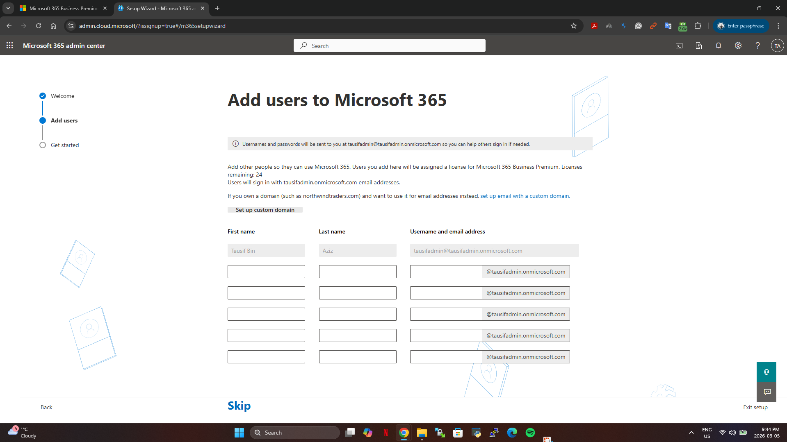

### Microsoft 365 Admin Dashboard

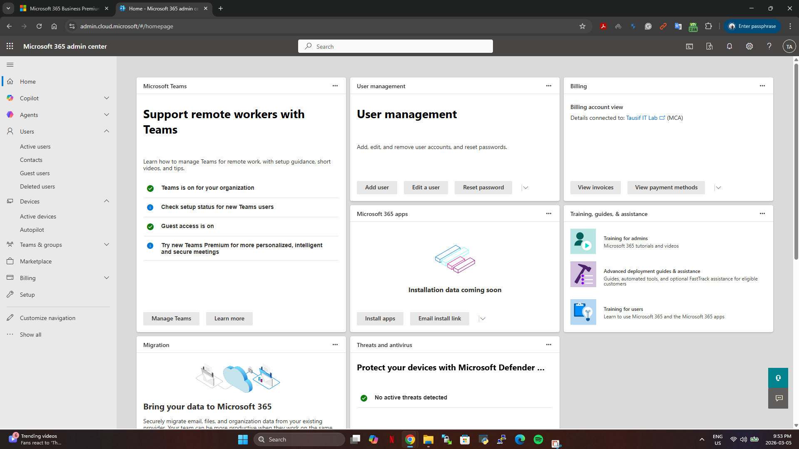

### Active Users

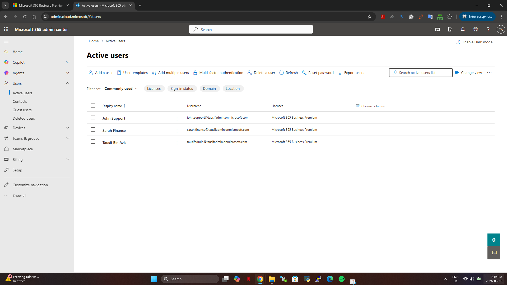

### Helpdesk Password Reset

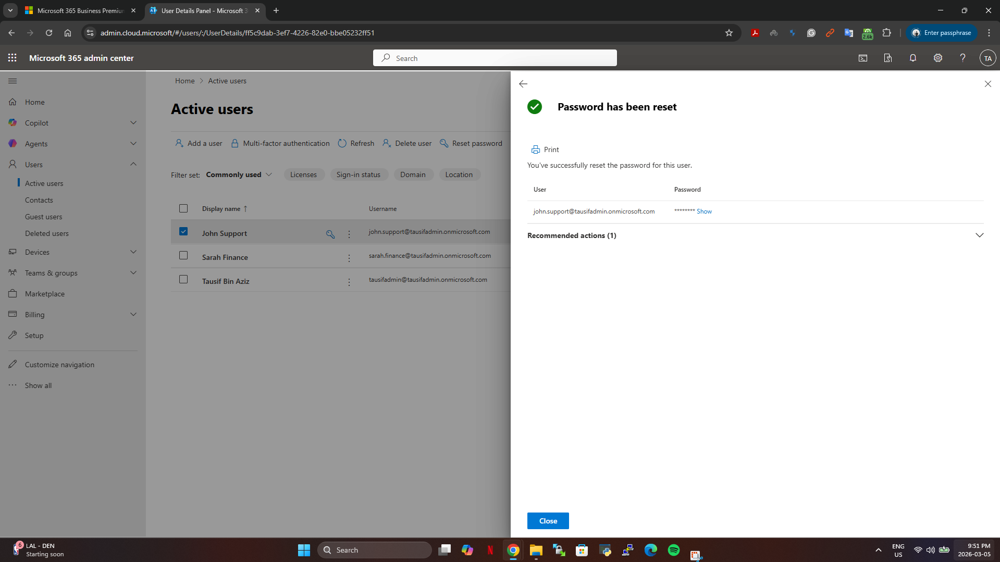

### User Role Assignment

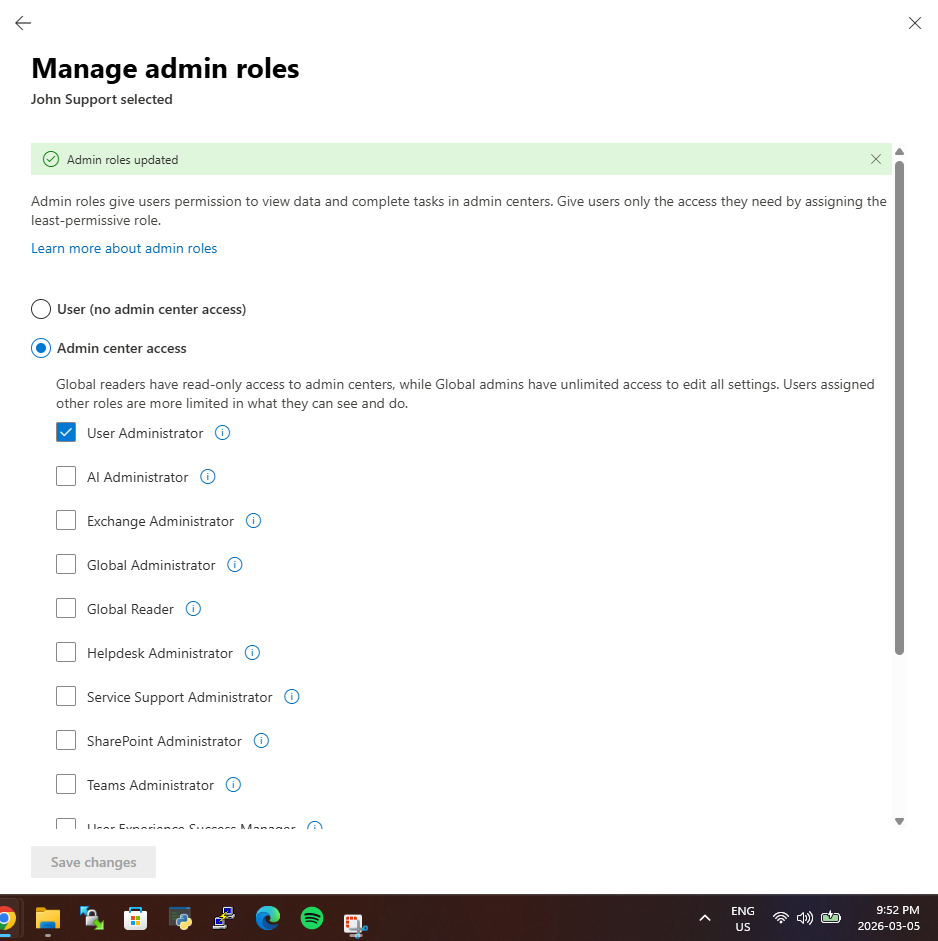

### Intune Endpoint Manager

### Device Compliance Policy

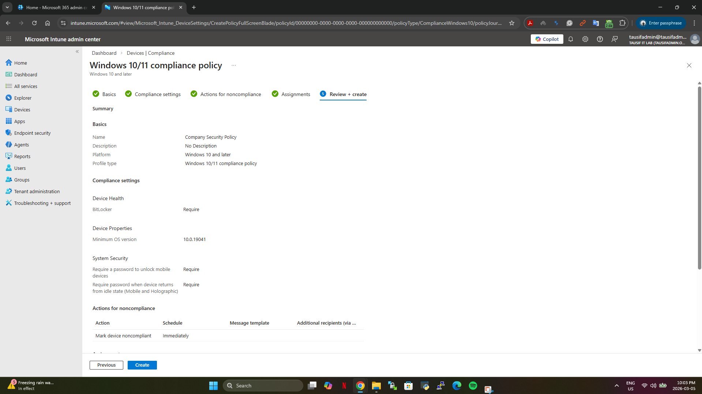

### Entra ID User Management

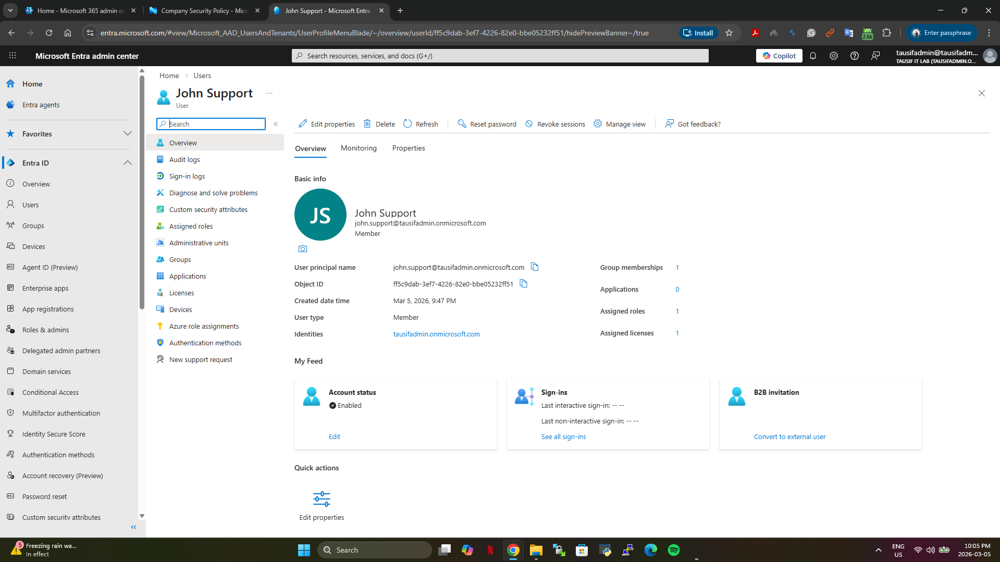

### MFA Configuration

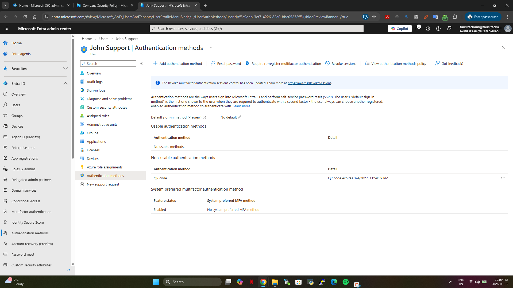

### Security Group Creation

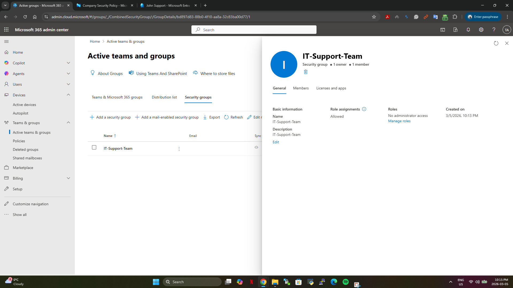

### Compliance Policy Assignment

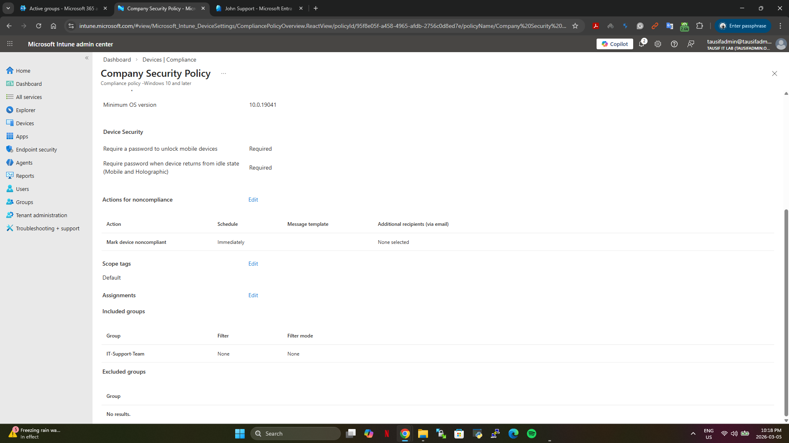

### Helpdesk Password Reset via Admin Center

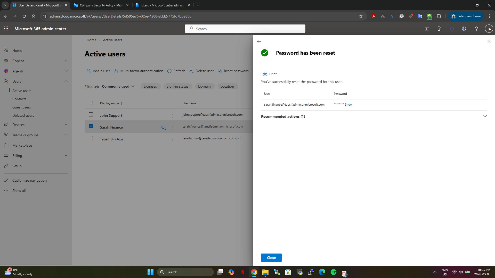

### User Sign-in Logs

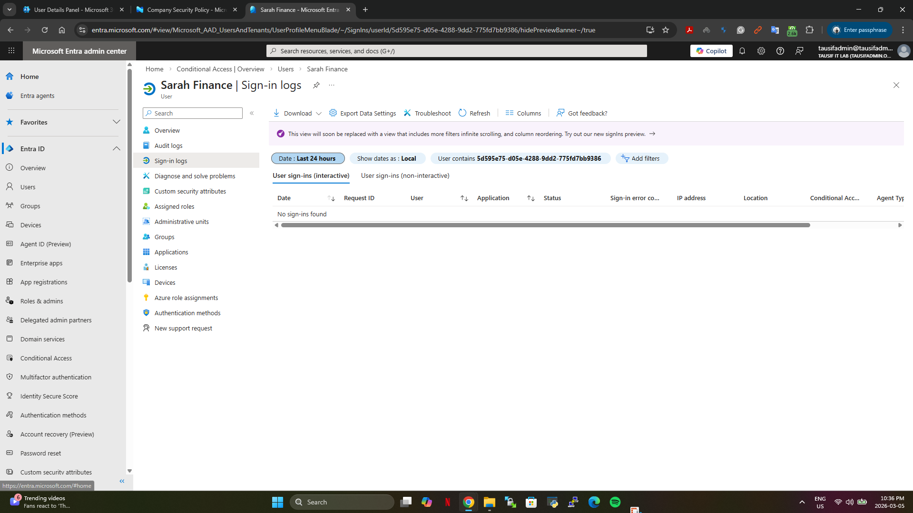

### Application Access Group

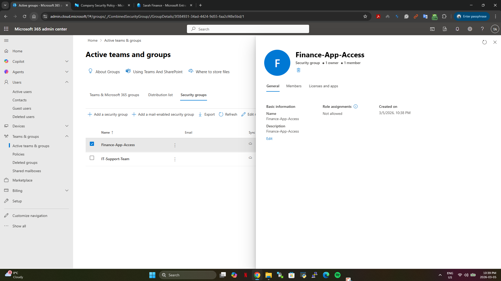

---

## Project Purpose

This project was created as part of an IT support portfolio to demonstrate hands-on experience with Microsoft 365 cloud administration, identity management, and enterprise security practices commonly used in modern organizations.

The lab showcases practical skills required for IT Support Engineer, Helpdesk Analyst, and System Administrator roles working with Microsoft 365 infrastructure.

---

## Author

Tausif Bin Aziz
IT Support / Systems Administration Portfolio Project
